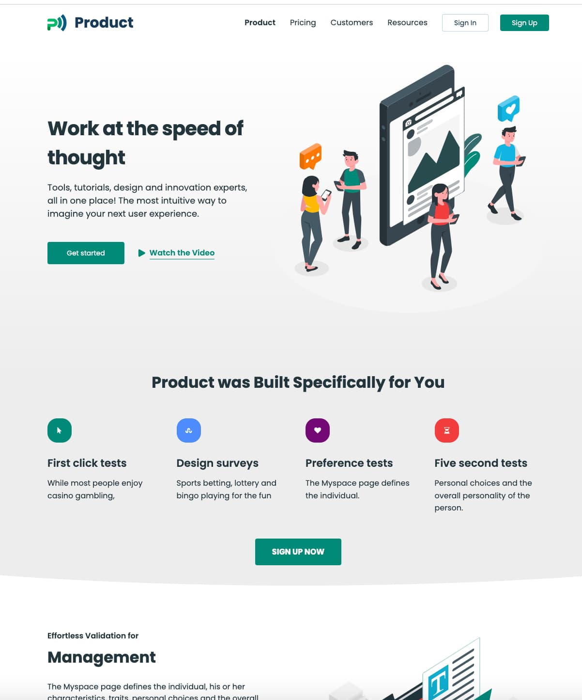
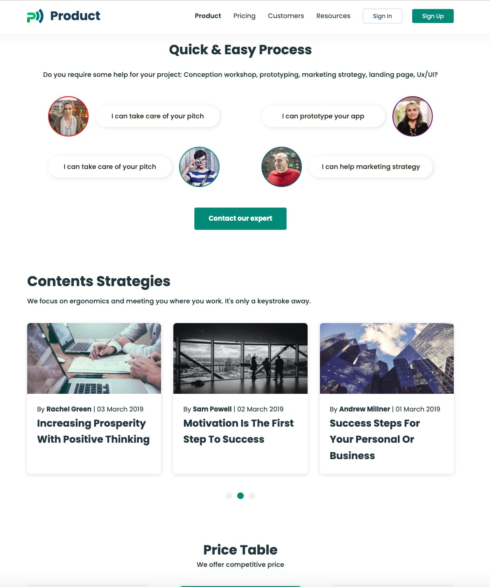
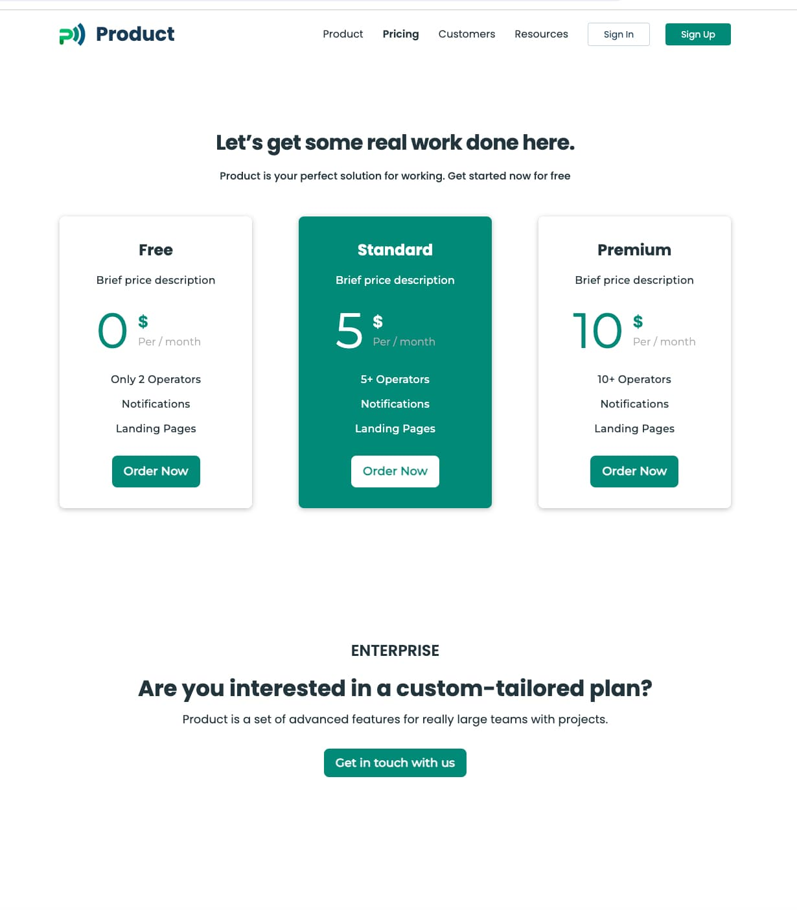
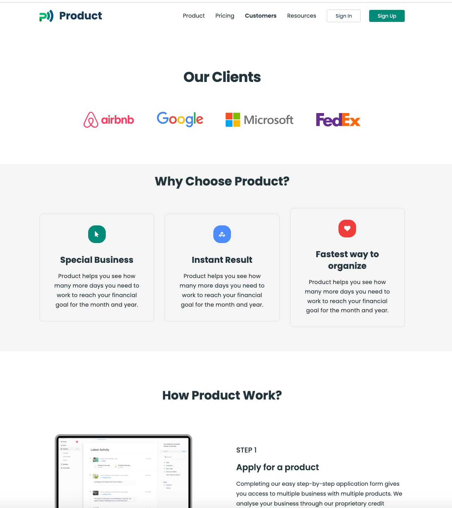

# Business "Product" Website

## Project Overview

This project involves building a responsive and animated web design for the business "Product." It is a freelance project that includes HTML/CSS for responsive web design across desktops, tablets, and mobile devices, JavaScript for added functionality, and smooth scrolling to enhance user experience. The project also incorporates a sticky header, a modal window for detailed news, a hidden menu for tablets and mobiles, and a scroll-up button for convenience.

## Table of Contents

- [Features](#features)
- [Technologies Used](#technologies-used)
- [Screenshots](#screenshots)
- [Issues](#issues)
- [License](#license)
- [Contact](#connect-with-me)

## Features

1. **Responsive Design:**

   - Optimized for desktop, tablets, and mobile devices.

2. **JavaScript Functionality:**

   - Enhanced user experience through interactive features.

3. **Sticky Header:**

   - The header remains fixed when scrolling through the main page.

4. **Smooth Scrolling:**

   - Seamless navigation between pages and sections.

5. **Modal Window:**

   - Detailed news can be viewed in a modal window.

6. **Hidden Menu-Burger:**

   - The main menu is hidden and accessible through a menu-burger for tablets and mobiles.

7. **Figma Wireframe:**

   - The project wireframe was created using Figma.

8. **Scroll Up Button:**
   - Convenient button for scrolling back to the top of the page.

## Technologies Used

- 
- 
- 
- 

## Screenshots

 _Caption for Screenshot 1
(Product Home Page)_

_Caption for Screenshot 2 (Product Home Page)_

_Caption for Screenshot 3 (Pricing Page)_

_Caption for Screenshot 4 (Customers Page)_

## Issues

If you encounter any issues or have suggestions, please
[open an issue](https://github.com/Alexandrbig1/business-product/issues).

## License

This project is licensed under the [MIT License](LICENSE).

## Feedback

I welcome feedback and suggestions from users to improve the application's
functionality and user experience.

## Languages and Tools:

  
 

## Connect with me:

